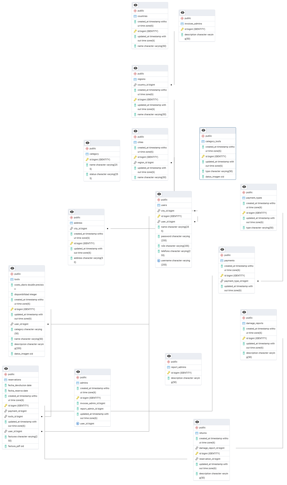

# 📦 HerraRent

Nuestra Misión
Proporcionar acceso a herramientas profesionales de alta calidad a precios accesibles, permitiendo a nuestros clientes completar sus proyectos con eficiencia y excelencia.

## 🛠 Tecnologías Utilizadas
- **Backend**: Java 21 + Spring Boot 3.2
- **Base de datos**: PostgreSQL
- **Autenticación**: JWT
- **Documentación**: Swagger UI


## 🚀 Comenzar

### 📋 Requisitos
- JDK 21 instalado
- PostgreSQL 15+
- Maven 3.9+

### 🔧 Instalación
```bash
git clone https://github.com/Stivenco12/Backend_proyecto_spring_boot_java.git


# Base de datos
spring.datasource.url=jdbc:postgresql://localhost:5432/prueba1
spring.datasource.username=postgres
spring.datasource.password=campus2023
spring.datasource.driver-class-name=org.postgresql.Driver
spring.sql.init.encoding=UTF-8
spring.jpa.show-sql=true
spring.jpa.hibernate.ddl-auto=create-drop

```

